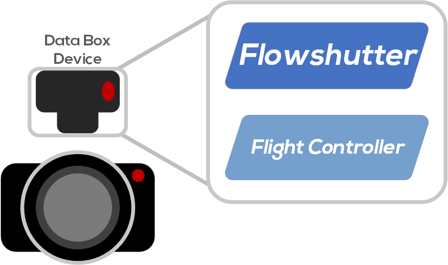

  <a href="https://gyroflow.xyz">Homepage</a> •
  <a href="https://docs.gyroflow.xyz/flowshutter/flowshutter/">Documentation</a> •
  <a href="https://discord.gg/WfxZZXjpke">Discord</a> •
  <a href="https://github.com/gyroflow/flowshutter/issues">Report bug</a> •
  <a href="https://github.com/gyroflow/flowshutter/issues">Request feature</a>

  
  
  
  
  
    
    

**Flowshutter** is a custom camera remote. When used in conjunction with readily available hardware, this results in a flexible and reliable external camera motion logger for Gyroflow. It can provide precise synchronization of camera video recording and motion logger (betaflight/emuflight FC) recording. 

**Flowshutter** aims to make all cameras ready for stabilization with [Gyroflow](https://github.com/gyroflow/gyroflow) software to provide you with one of the best open-source video stabilization experiences.

## Features

Flowshutter has the following features:

- '1-click' - (1) start/stop camera recording and (2) arm/disarm FC, via one click 
- Camera recording start/stop control
- FC arm/disarm control
- OLED display

with many more features on the way!

## Hardwares
### Basic View

### Supported Hardware

Currently we are wroking with NeutronRC for a small range of sales in China. Subsequent versions are in production, please stay tuned.

At the same time you can try to DIY your own flowshutter hardware. We have two open sourced designs:

- [Credit card sized design](https://oshwhub.com/AirFleet/xiang-ji-kong-zhi-ban):

- [FC sized design](https://oshwhub.com/AirFleet/xiang-ji-kong-zhi-ban_copy_copy): 

### Compatible camera protocol/trigger mechanisms

- [x] Sony MULTI Terminal protocol
- [x] Momentary Ground
- [x] 3.3V Schmitt trigger
- [x] ZCAM UART protocol
- [ ] 5V Schmitt trigger (WIP)
- [ ] Sony LANC protocol (WIP)
- [ ] HDMI CEC protocol (WIP)

For more information about support camera list, please check the [list](https://docs.gyroflow.xyz/flowshutter/clist/) on the [documentation website](https://docs.gyroflow.xyz/).

### Compatible FC

FC is short for flight controller, more specifically with betaflight/emuflight running on.

- flowbox (highly recommended)
- modern FC with BMI270 gyroscope (recommended)
- any other FC that support CRSF protocol

## Development Guide
### Flash micropython firmware

The micropython firmware we used is [v1.19.1](https://micropython.org/resources/firmware/esp32-20220618-v1.19.1.bin), You can find a copy in the `/tools` directory. Also, a `uPyCraft` windows version is also provided in the `/tools` directory. You can try to use that to flash your ESP32 without the help of ESP-idf.

### Set up environment

#### Visual Studio Code with Pymakr extension

1. Install `node`
2. Install `Visual Studio Code`
3. Install `Pymakr` extension in `Visual Studio Code`
4. Edit `address` in `pymakr.conf` to your flowshutter's COM port
5. Pull flowshutter code from `https://github.com/gyroflow/flowshutter`
6. Then you can connect and upload the flowshutter code

#### Thonny IDE
TBD

## License

This project is licensed under:

- CC-BY-NC-ND 4.0
- AGPL 3.0

**Note:** AGPL 3.0 is only avaliable after you signed our CLA.

This software is provided as is, and please feel free to use this on your own camera which will be used for shooting/recording comercial images/videos. Please contact [DusKing1](1483569698@qq.com) if you intend to use it for other commercial purposes.

## Pillar of shame

**Due to egregious abuse of open source in Wuxi, China, this project refuses to provide any support to any user in Wuxi, or to cooperate in any form with any company or individual in Wuxi. Please do something worthy of your conscience.**
