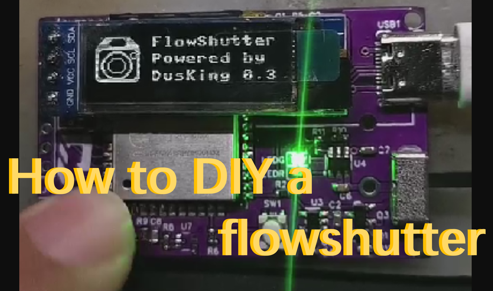

# Flowshutter

  <a href="https://gyroflow.xyz">Homepage</a> •
  <a href="https://discord.gg/WfxZZXjpke">Discord</a> •
  <a href="https://github.com/gyroflow/flowshutter/issues">Report bug</a> •
  <a href="https://github.com/gyroflow/flowshutter/issues">Request feature</a>

  
  
  
  

Flowshutter is a custom camera remote. When used in conjunction with readily available hardware, this results in a flexible and reliable external camera motion logger for Gyroflow. It can provide precise synchronization of camera video recording and motion logger (betaflight/emuflight FC) recording. 

It was designed to be used with the [Gyroflow](https://github.com/gyroflow/gyroflow) software to provide you one of the best open source video stabilization experiences.

## Features

Flowshutter has the following features:

- '1-click' - (1) start/stop camera recording and (2) arm/disarm FC, via one click 
- Camera recording start/stop control
- FC arm/disarm control
- OLED display

with many more features on the way!

## Supported Hardware

Flowshutter haven't worked with any manufacturer yet. So there's no "Ready-to-Use" commercial hardware/product yet.

However you can try to build an official design from us at your own! The community version can be found on [here](https://oshwhub.com/AirFleet/xiang-ji-kong-zhi-ban). Check out our [Build Video](https://www.youtube.com/watch?v=ELaQPYE9ncA)!

### Compatible camera protocol/trigger mechanisms

- [x] Sony Multiport USB protocol
- [] Sony LANC protocol (WIP)
- [] Canon shutter wire (WIP)
- [] Nikon protocol (WIP)
- [] Others are on the way

### Compatible FC

FC is short for flight controller, more specifically with betaflight/emuflight running on.

- flowbox (highly recommended)
- modern FC with BMI270 gyroscope (recommended)
- any other FC that support CRSF protocol

## License

- documents under ``/doc`` are licensed under MIT
- micropython binary  ``/tool/esp32-20210902-v1.17.bin`` comes from micropython, licensed under MIT
- SSD1306 driver ``/ssd1306.py`` comes from micropython, licensed under MIT
- uPyCraft_V1.1.exe ``/tool/uPyCraft_V1.1.exe`` is no licensed
- other code is under AGPL-v3.0 **ONLY**

This software is provided as is, and please feel free to use this on your own camera which will be used for shooting comercial images/videos. For any other commercial usage, please contact [DusKing1](1483569698@qq.com).
